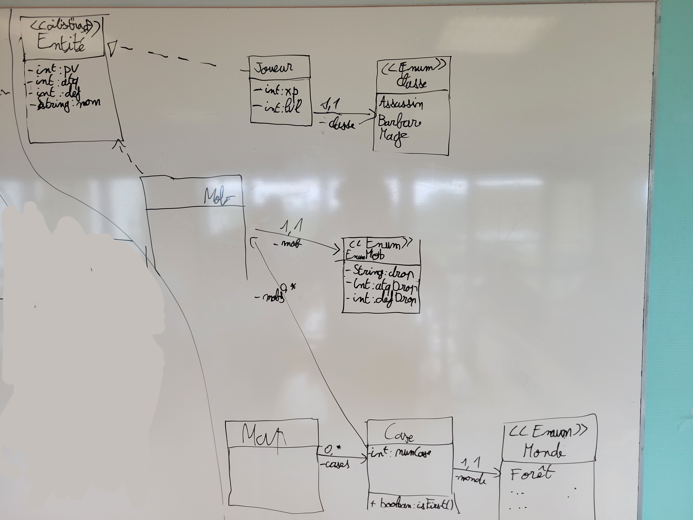
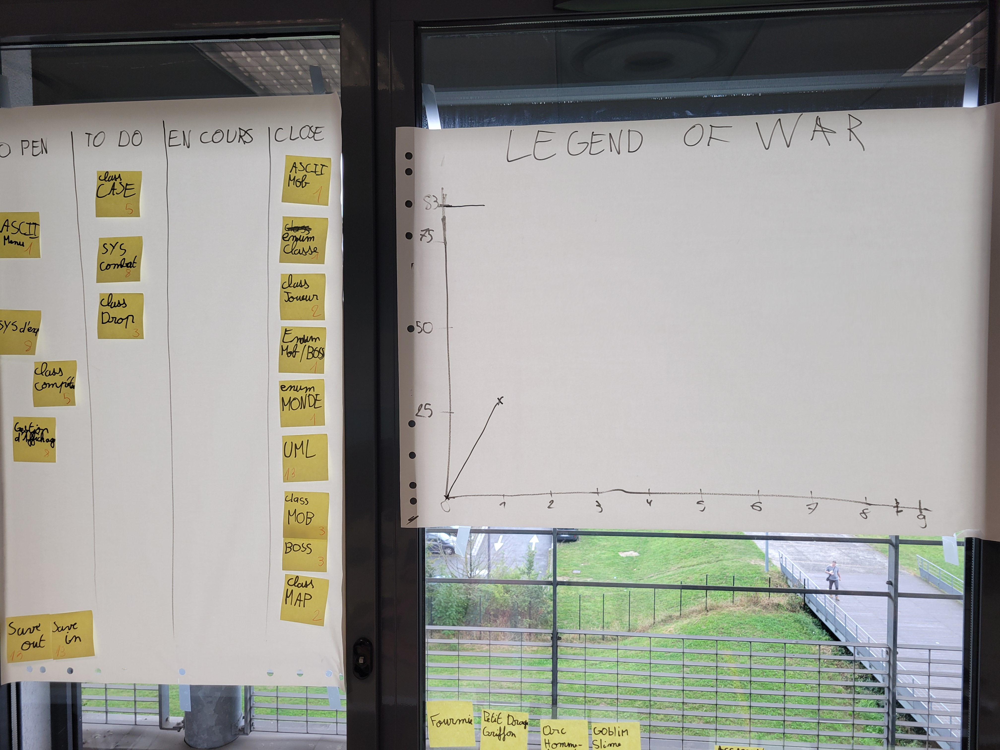

# Sprint 1

## Démo + Planification du sprint suivant

### Ce que nous avons fait durant ce sprint

- UML
- Enum MOB / BOSS
- Enum MONDE
- Enum CLASSE
- Class JOUEUR
- Class Case
- Test Mob
- Class main pour demo

### Ce que nous allons faire durant le prochain sprint

- Class CASE
- Système de Combat
- Class DROP

## Rétrospective

### Sur quoi avons nous butté ?

Rien pour l'instant, tout va bien.

### PDCA

Rien à améliorer pour l'instant

# Mémo

