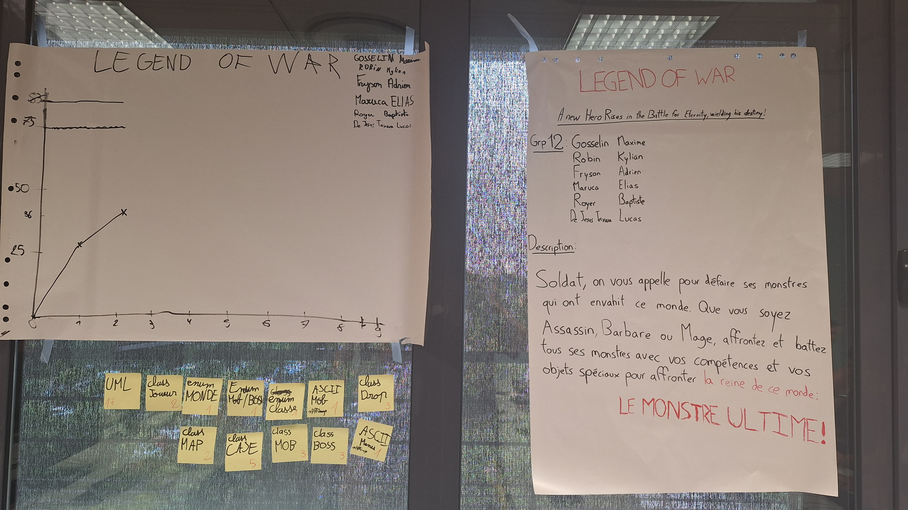

# Sprint 2

## Démo + Planification du sprint suivant

### Ce que nous avons fait durant ce sprint

- Class CASE
- Début de la gestion d'affichage
- Class Item
- Gestion des stats des mobs et des drop (Game Design)

### Ce que nous allons faire durant le prochain sprint

-Présentation du Projet
-Liste et Stats des compétences
-Ecriture de sauvegarde

## Rétrospective

### Sur quoi avons nous butté ?

* Problème de gestion du temps, la demo était séparé sur 2 ordinateurs
* On avait terminé tout ce que nous avions à faire mais la démo n'était pas prête.

### PDCA

* Nous pourrions mieux gérer le temps. 
* Si on est prêt à temps pour la démo à la fin du prochain sprint, l'amélioration sera visible.
* Désigner quelqu'un qui nous prévient 15 minutes avant la démo

# Mémo
