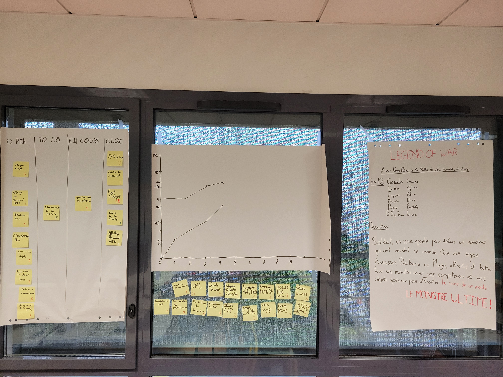

# Sprint 4

## Démo + Planification du sprint suivant

### Ce que nous avons fait durant ce sprint

- Classement page WEB
- Système d'XP
- Choix de la classe
- Gestion objets
- Ajustement des sprites

### Ce que nous allons faire durant le prochain sprint

- Déroulement de la partie
- Menu principal
- Gestion des compétences

## Rétrospective

### Sur quoi avons nous butté ?

Durant ce sprint, nous avons sur-éstimé nos compétences et avons mis pris trop de US

### PDCA

* Pour nous améliorer, nous pouvons prendre moins d'US pour le sprint
* Nous avons donc compté notre vélocité, et avons décider de prendre 20 points d'efforts maximum pour les prochains sprints

# Mémo

