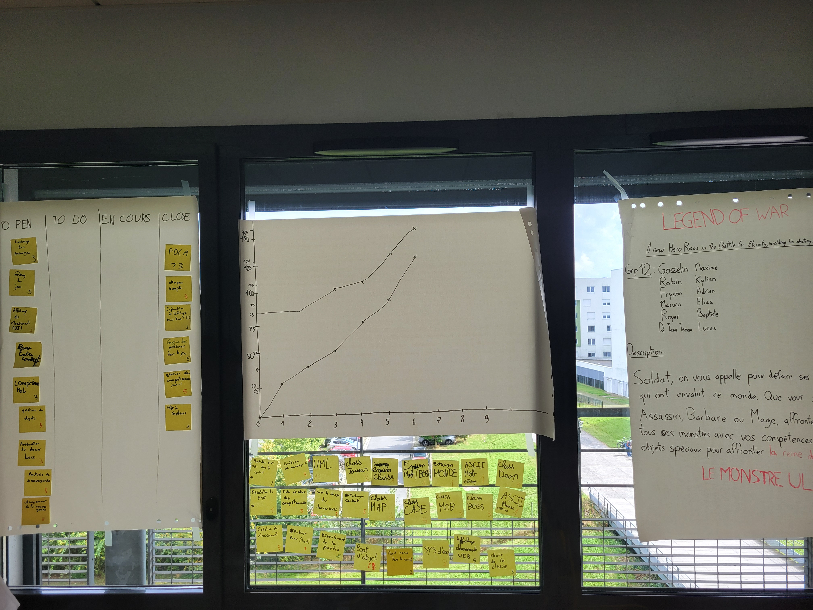

# Sprint 6

## Démo + Planification du sprint suivant

### Ce que nous avons fait durant ce sprint

* Attaque Simple
* Gestion des compétences (joueurs)
* Gestion des problèmes dans le jeu
* Implémentation de l'affichage du menu dans l'UI
* PDCA

### Ce que nous allons faire durant le prochain sprint
* Gestion des compétences (mob)
* Gestion des objets

## Rétrospective

### Sur quoi avons nous butté ?
* Sprint plutôt efficace, nous avons terminés tout ce que nous nous étions engagés à faire
* La démo était prête, avec les attaques simples, les compétences joueurs et l'affichage du menu

### PDCA
* 

# Mémo

